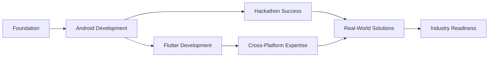

# Hello, I'm Devesh Rawat!

**3rd Year B.Tech CSE Student | Android & Flutter Developer | State-Level Hackathon Champion**

---

## About Me

I'm a passionate **3rd year Computer Science Engineering student** at Veer Madho Singh Bhandari Uttarakhand Technical University with a strong focus on mobile application development. My journey in tech is driven by creating solutions that make a real-world impact, demonstrated by my state-level hackathon victory.

### What I Bring to the Table:
- **State-Level Hackathon Champion** - 1st prize awarded by the Governor of Uttarakhand
- **Mobile Development Expertise** - Android (Kotlin/Java) and Flutter development
- **Project Excellence** - Building complete, functional applications from concept to deployment
- **Continuous Learner** - Always expanding my skillset with new technologies
- **Problem Solver** - Passionate about tackling real-world challenges through technology

###  Current Focus:
- Enhancing my skills in **Flutter cross-platform development**
- Exploring **advanced Android architectures** and modern development practices
- Building **scalable applications** with clean code principles
- Contributing to **open-source projects** in the mobile development space

### Academic Journey:
- **B.Tech in Computer Science Engineering** (2023-2027)
- **Veer Madho Singh Bhandari Uttarakhand Technical University**
- **Student Coordinator** - University Counsellor Counselee Program
- **Active Participant** in tech communities and coding competitions

---

## Technical Arsenal

**Mobile Development:**  

**Frontend Technologies:**  

**Backend & Databases:**  

**Tools & Platforms:**  

**Programming Languages:**  

---

## GitHub Highlights

  

---

## Notable Achievements

### Him Rakshak - Disaster Management App
**State-Level Hackathon 1st Prize Winner**  
Developed a comprehensive disaster alert system using Kotlin, FastAPI, and MongoDB that enables real-time environmental reporting with photo and location capabilities.

### Technical Milestones:
- **Multiple Certifications** in Android Development and Programming
- **Active Open-Source Contributor** with growing project portfolio
- **Technical Lead** in university projects and hackathons
- **Continuous Skill Development** with latest mobile technologies

### Certifications:
- Responsive Web Design - freeCodeCamp (2024)
- Complete Android 14 & Kotlin Development - Udemy (2025)
- Java Programming - HackerRank (2024)
- Ethical Hacking & Cyber Security - WorldTechnocon, IIT Roorkee (2024)

---

## Featured Projects

### Him Rakshak
Award-winning disaster management Android app featuring real-time alerts, environmental reporting, and emergency guides built with modern Android architecture.

### DevBot AI Chatbot
Intelligent chatbot application integrated with Gemini API, showcasing modern Android development with Jetpack Compose and clean architecture principles.

### Smart Expense Tracker
Personal finance management app with intuitive UI, data visualization, and secure local storage using Room database.

### Automated Certificate System
Python-based automation tool for certificate generation and distribution, demonstrating full-stack development capabilities.

---

## My Development Journey

---

## Let's Connect & Collaborate

---

### Always Building, Always Learning
*Exploring new technologies and creating impactful solutions every day*

**Open to internship opportunities in Android/Flutter development!**

